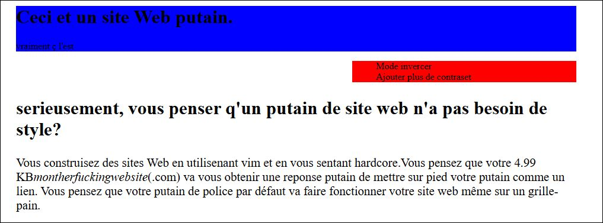

# BetterMotherFunckingWebsite

## Description

Ce projet est une reproduction améliorée du site **BetterMotherFunckingWebsite**, réalisée dans le cadre d'un exercice du parcours **The Hacking Project (THP)**. Il utilise les technologies web de base : HTML, CSS et JavaScript + photo.

Ce projet est une page HTML brute, inspirée de la célèbre satire motherfuckingwebsite.com, traduite et adaptée en français.
L’objectif est de démontrer, avec humour, qu’un site peut être fonctionnel, accessible, rapide et clair, sans effets visuels superflus.

toufois dans un bute pedagogique j'ais ajouter quelle que effes visuele.

## Objectifs

- Reproduire fidèlement le site original.
- Pratiquer la manipulation du HTML, CSS et JavaScript.
- Apprendre à organiser un projet web simple.

## Capture d'écran



click sur ajouter plus de contraste et observés le resulta

un fond noir pour plus de clarter :)


## Structure du projet

```
BetterMotherFunckingWebsite2/
├── bettermotherfunckingsitewed.html  # Fichier HTML principal
├── style.css                         # Feuille de style CSS
├── script.js                        # Script JavaScript
├── photo                            # images
├── README.md                        # Ce fichier
```

## Installation et utilisation

1. Clonez ce dépôt :

```bash
git clone https://github.com/davidSoutarson/BetterMotherFunckingWebsite2.git
```

2. Ouvrez `bettermotherfunckingsitewed2.html` dans votre navigateur web.

## Contribution

N’hésitez pas à faire des pull requests ou à proposer des améliorations.

## Licence

Ce projet est libre et open source.

---

_Réalisé dans le cadre de The Hacking Project._
